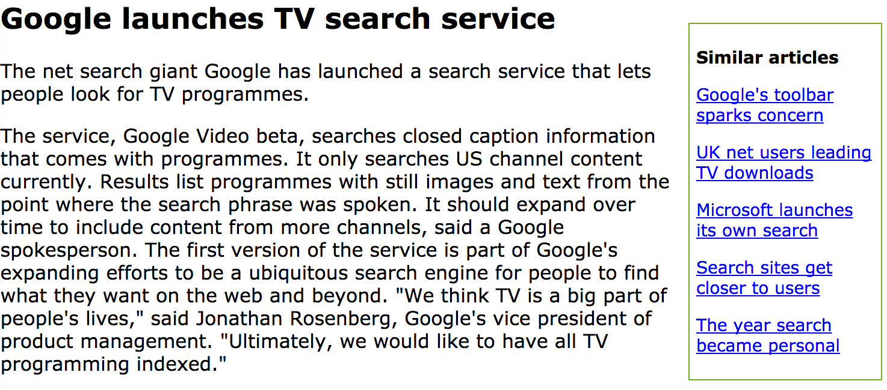

# Data-Acqusition-Implementation

This repo contains 2 projects from University of San Francisco MSDS [Data Acquisition](https://github.com/zren15/msds692-Data-Acquisition).

## Twitter Sentiment Analysis 

Find my [code](https://github.com/zren15/Data-Acqusition-Implementation/tree/main/twitter_sentiment_analysis/Code) here. 

- In the `Twitter Sentiment Analysis` project, we retrieved tweets via the tweepy API object and extracted user information, including profile image, real name, number of followers. We also created date by parsing HTML on Twitter profile page.

- In addition, we performed sentiment analysis using vaderSentiment package and deployed a tweet list page on AWS that differentiates each feeds’ sentiment based on color codes as well as shows the users and followers details.

Here is the example:

 

### Work I have done
+ Scrape data from Twitter
+ Parse tweets to remove random stuff
+ Calculate the sentiment via the [vaderSentiment](https://github.com/cjhutto/vaderSentiment) package
+ Visualize the sentiment from Red (-1: very negative) to Green (+1: very positive)

## BBC Article Recommender

Find my [code](https://github.com/zren15/Data-Acqusition-Implementation/tree/main/article_recommender/Code) here. 

- In the `BBC articles recommendation` project, we utilized the [BBC Articles](https://github.com/zren15/Data-Acqusition-Implementation/tree/main/article_recommender/Code/bbc) copyright from [BBC data](http://mlg.ucd.ie/datasets/bbc.html) to replicate a basic BBC website. We applied a natural language processing technique word2vec [Glove](https://nlp.stanford.edu/projects/glove/) to calculate the 'closeness' among articles.

- Finally, we displayed the article recommendations based on similar word vector centroid using HTML, jinja2, flask, gunicorn, AWS. On the web page, we will find the cloest 5 articles names on the right.

Here is the example:

Thanks to Prof. [Terence Parr](https://github.com/parrt) for his guidance and support in this school project.
